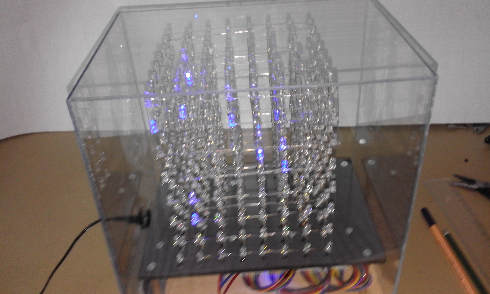

# LED-Cube
Eine schöne Idee, die sich als wesentlich kniffliger zeigte also zunächst vermutet.
Zunächst haben wir es mit dem ebenfalls hier beschriebenen Übungssystem versucht. Der frei fliegende Aufbau hat aber so viele Probleme verursacht, dass wir eine einzige Platine entwirfen haben, die alle erforderlichen Komponenten enthält. Das sind im Wesentlichen:
- Der Controller
- Die High-Side-Treiber
- Der Multiplexer

Diese Platine hat dann problemlos funktoniert.

So sieht das Ganze dann fertig aus. Eine Acrylglashaube schützt vor Staub. (Ein schöneres Bild brauchen wir aber noch)

